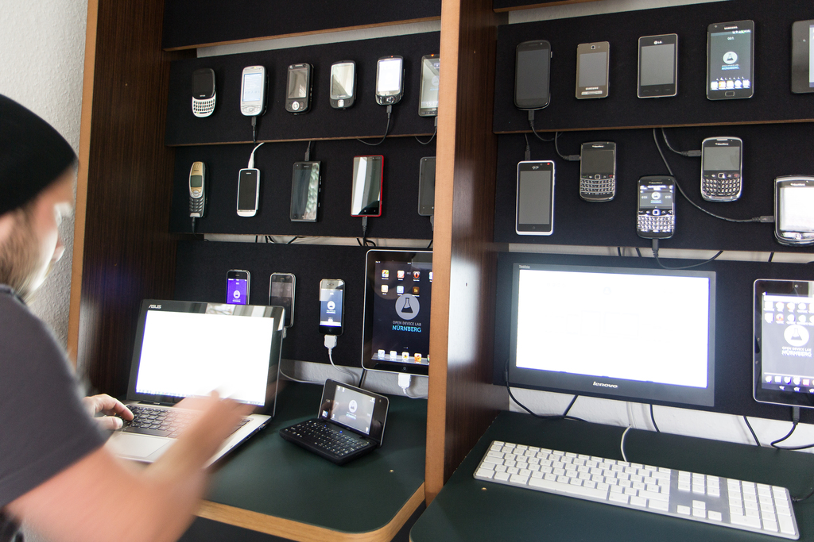

# Willkommen!

zum<br/>
Accessibility Club #1<br/>
am 16.7.2014

---

<!-- .slide: class="invert" data-background="#ffffff" -->

## Echte Geräte. Echte Tests.

c/o tollwerk GmbH<br/>
Lindenaststraße 15<br/>
90409 Nürnberg<br/>
[http://odl-nbg.de](http://odl-nbg.de)

***



* Kostenlose Teststation für Webworker
* Aktuell ~40 internetfähige Geräte
* Ca. 120 ODLs weltweit ([opendevicelab.com](http://opendevicelab.com)) 

***

Ab sofort neu im ODL Nürnberg
# Testen mit JAWS
* Zweckgebundene Spende von Marjorie Roswell
* Unterstützt durch Wilhelm Lutzenberger / [ProTak](http://protak.net)

<blockquote>[JAWS](http://www.freedomsci.de/prod01.htm) (bzw. ein beliebiger Screenreader) alleine hilft nichts, man muss damit umgehen können. Das ODL-Personal muss geschult werden, um Tester anleiten und unterstützen zu können</blockquote><!-- .element: class="fragment block icon-quotes-left" data-fragment-index="1" -->

<div><br/>→ Idee zum [Accessibility Club](http://accessibility-club.org)</div><!-- .element: class="fragment" data-fragment-index="2" -->

---

# Barrierefreiheit im Web

<blockquote>Barrierefreies Internet sind Web-Angebote, die von allen Nutzern unabhängig von körperlichen oder technischen Möglichkeiten uneingeschränkt (barrierefrei) genutzt werden können. [Wikipedia](http://de.wikipedia.org/wiki/Barrierefreies_Internet)</blockquote><!-- .element: class="block icon-quotes-left" -->

***

# Barrierefreiheit ≠ Mainstream

### Typische Erwartungen<!-- .element: class="fragment" data-fragment-index="1" -->

* Falsches Verständnis (»valider Quellcode = barrierefrei«)<!-- .element: class="fragment" data-fragment-index="2" -->
* (Vermeintlich) Höherer Aufwand und Mehrkosten<!-- .element: class="fragment" data-fragment-index="3" -->
* »Barrierefreiheit = Designfreiheit«<!-- .element: class="fragment" data-fragment-index="4" -->

Note: Statistik über die allgemeine Barrierefreiheit im Internet

***

# Barrierefreiheit ≠ Mainstream

### In Wirklichkeit ...

... wird Barrierefreiheit mangels Kenntnis und persönlicher Erfahrungen nicht praktiziert. Entwicklern fehlt das Wissen zu<!-- .element: class="fragment" data-fragment-index="1" -->

* den Bedürfnissen behinderter Internetnutzer,<!-- .element: class="fragment" data-fragment-index="2" -->
* den verfügbaren Techniken (Web- & assistive Technologien)<!-- .element: class="fragment" data-fragment-index="3" -->

***

# Ziele des Accessibility Club

* Abbauf von Barrieren
* Schaffen von Berührungspunkten
* Sammeln von Erfahrung
	* im Kontakt mit behinderten Internetnutzern
	* im Umgang mit barrierefreien Techniken und assistiven Technologien

---

# Barrierefreiheit

## Zielgruppe
* Menschliche Nutzer
* Maschinen / Robots *(»Alles, was Sehbehinderten Probleme bereitet, ist auch für (Suchmaschinen-)Robots ein Hindernis«)*

<div>*Behindertengerechtigkeit* ist nur ein Teilaspekt von Barrierefreiheit! Auch nicht-behinderte Nutzer sollen keine Barrieren im Sinne spezifischer Voraussetzungen überwinden müssen</div><!-- .element: class="fragment block icon-warning" data-fragment-index="1" -->

***

## Anwendungsbereiche
* Internet
* Native Programme / Apps
* Betriebssysteme

***

## Technische Barrierefreiheit
* <!-- .element: class="fragment" data-fragment-index="1" -->Unabhängigkeit von Hardware, Software, Anbindung (→ Schnittstelle zu [Performance-Themen](#performance))
* Plattform- & geräteübergreifende Nutzbarkeit (verschiedenste Endgeräte, assistive Technologien)<!-- .element: class="fragment" data-fragment-index="2" -->
* Zugänglichkeit (»Accessibility«) durch Einsatz geeigneter Techniken<!-- .element: class="fragment" data-fragment-index="3" -->

## Inhaltliche Barrierefreiheit
* <!-- .element: class="fragment" data-fragment-index="4" -->Verständliche Formulierung (z.B. [Leichte Sprache](http://de.wikipedia.org/wiki/Leichte_Sprache))
* Geeignet für Menschen mit kognitiven Einschränkungen (Geistige Behinderung, mangelnde Sprachkenntnis, etc.)<!-- .element: class="fragment" data-fragment-index="5" -->
* Keine übermäßigen Anforderungen an Alter, Bildungsstand etc.<!-- .element: class="fragment" data-fragment-index="6" -->

---

# Assistive Technologien (im IT-Bereich)
* Screenreader
* Braille-Zeile
* Vergrößerungssoftware (Bildschirmlupe)
* Spracheingabe
* Bildschirmtastatur
* usw.

---

# Barrierefreie Techniken im Web
### Wichtige Grundvoraussetzungen

* Verwendung von **Webstandards**
* **Validität** unterstützt die **Kompatibilität mit assistiven Technologien** (ist alleine aber kein Garant für Barrierefreiheit!)
* Strikte **Trennung von Inhalt / Struktur & Darstellung**

***

## 1. Logische Struktur — durch HTML-Bordmittel
* <!-- .element: class="fragment" data-fragment-index="1" -->HTML-Elemente entsprechend ihrer Bedeutung (Semantik) einsetzen, z.B. Überschriften
```html
<h1>Überschrift 1</h1>
<h2>Unterüberschrift 2</h2>
```
→ Assistive Technologien und Robots können daraus Informationstopologien (»Landmarks«) und Inhaltsverzeichnisse (»Outlines«) ableiten und präsentieren
* <!-- .element: class="fragment" data-fragment-index="2" -->Insbesondere HTML5 bietet ein reiches, semantisches Vokabular (`main`, `nav`, `article`, `section`, `aside`, `footer` usw.) 
* <!-- .element: class="fragment" data-fragment-index="3" -->Korrekt eingesetztes HTML ist von Haus aus recht barrierefrei (z.B. Navigieren per Tastatur durch Springen zwischen Links)

<!-- .element: class="block icon-point-right fragment" data-fragment-index="4" -->Statt Barrierefreiheit herzustellen müssen wir oft eher aufpassen, sie nicht zu zerstören!

***

## 2. Semantische Ergänzung — durch WAI-ARIA
* <!-- .element: class="fragment" data-fragment-index="1" -->Semantische Erweiterung für HTML, die das Layout nicht verändert
* <!-- .element: class="fragment" data-fragment-index="2" -->Ergänzung von:
	* **Rollen** (z.B. `role="nav"` für Navigation, `role="main"` für Hauptinhalt)
	* **Eigenschaften** (z.B. `aria-label` für Bezeichnerelemente, `aria-required` für Formular-Pflichtelemente)
	* **Zustände** (z.B. `aria-invalid` für ungültige Formular-Elemente, `aria-hidden` für nicht wiederzugebende Inhalte — betrifft im Unterschied zur CSS-Eigenschaft `display:hidden` auch Screenreader)
	
<!-- .element: class="block icon-warning fragment" data-fragment-index="3" -->WAI-ARIA ist kein Ersatz, Ausgleich und erst recht keine Entschuldigung für mangelhaft eingesetztes HTML!

***

## 3. Präsentation & Layout — durch CSS
* <!-- .element: class="fragment" data-fragment-index="1" -->(Seh)Behinderte können sich nicht »mal schnell einen Überblick verschaffen« oder »Querlesen«
* <!-- .element: class="fragment" data-fragment-index="2" -->Sie sind auf die Strukur & Reihenfolge im Dokument(quelltext) angewiesen 
* <!-- .element: class="fragment" data-fragment-index="3" -->Möglichkeit: Entkopplung der Darstellungsposition von der Position im Quelltext durch **Positionierung per CSS** (z.B. unwesentliche Inhalte am Dokumentende, in der Darstellung jedoch oben)
* <!-- .element: class="fragment" data-fragment-index="4" -->**Relative Maßeinheiten** für Dimensionen & Schriftgrößen (z.B. `%`, `em`/`rem`) → **Skalierbarkeit** (durch den Browser / Client)
* <!-- .element: class="fragment" data-fragment-index="5" -->Geeignete **Farb- & Kontrastschemata** (ggf. sogar wählbar für den Nutzer), Kontrolle über Vorder- und Hintergrundfarben

***

## 4. Plakativität — durch grafische / visuelle Inhalte
* <!-- .element: class="fragment" data-fragment-index="1" -->Grafiken sind nicht per se Barrieren, sondern können bei der Informationsvermittlung helfen (auch bei kognitiven Einschränkungen)
* <!-- .element: class="fragment" data-fragment-index="2" -->Grafiken zu Layout-Zwecken sind generell Tabu (keine Frage der Barrierefreiheit)
* <!-- .element: class="fragment" data-fragment-index="3" -->Informative / notwendige Grafiken sollen mit Textalternativen versehen sein
```html

```
* <!-- .element: class="fragment" data-fragment-index="4" -->Auch für SVG (vereinfachtes Beispiel):
```xml
<svg version="1.1" width="300" height="200">
	<title>Green rectangle</title>
	<rect width="75" height="50" rx="20" ry="20" fill="#90ee90" stroke="#228b22" stroke-fill="1" />
</svg>
```

***

## 5. Interaktivität & Navigation — "progressively enhanced"
* <!-- .element: class="fragment" data-fragment-index="1" -->Die einfachste Darstellungsform (= nur HTML) sollte barrierefrei und durch assistive Technologien sinnvoll nutzbar sein (»accessible first«)
* <!-- .element: class="fragment" data-fragment-index="2" -->Zusätzliche Schichten sollten **Ergänzungen** liefern, nicht Betriebs- oder Nutzungsvoraussetzungen
	* CSS für die Präsentation
	* (Unobtrusives) JavaScript für Funktionalität & Interaktivität
	* usw.
* <!-- .element: class="fragment" data-fragment-index="3" -->Bedienbarkeit per Tastatur (für Personen mit motorischen Einschränkungen)

<!-- .element: class="block icon-warning fragment" data-fragment-index="4" -->Dynamisch aufbereite und interaktiv zugängliche Inhalte können Barrieren begünstigen (z.B. AJAX)

***

## 6. Inhaltliche Erschließbarkeit
* <!-- .element: class="fragment" data-fragment-index="1" -->Verständliche, angemessene Formulierungen
* <!-- .element: class="fragment" data-fragment-index="2" -->Keine rein grafischen Inhalte (z.B. Icons ohne Beschriftung)
* <!-- .element: class="fragment" data-fragment-index="3" -->Nutzer mit Farbfehlsichtigkeit berücksichtigen
* <!-- .element: class="fragment" data-fragment-index="4" -->Keine Technikbarrieren bei Navigation und essenziellen Inhalten (Bilder, Flash, Java-Applets)
* <!-- .element: class="fragment" data-fragment-index="5" -->Nutzung von z.B. Akronymen und Abkürzungen
```html
<abbr title="Barrierefreie Informationstechnik-Verordnung">BITV</abbr>
```
Tipp: Per CSS in modernen Browsern: „BITV (Barrierefreie Informationstechnik-Verordnung)“
```css
abbr[title]::after {
	content: ' ('attr(title)')';
}
```
* <!-- .element: class="fragment" data-fragment-index="6" -->Für Gehörlose: Visuelle Inhalte (Idealfall: Gebärdensprache)
* <!-- .element: class="fragment" data-fragment-index="7" -->[Leichte Sprache](http://de.wikipedia.org/wiki/Leichte_Sprache) für Nutzer mit kognitiven Einschränkungen

***
<!-- .element: id="performance" -->
## 7. Verfügbarkeit — durch Performanceoptimierung
* <!-- .element: class="fragment" data-fragment-index="1" -->Reduktion von Downloads (Bildoptimierung, Kompression / Minifizierung, etc.)
* <!-- .element: class="fragment" data-fragment-index="2" -->Reduktion anzufragender Dateien (HTTP-Requests) durch Zusammenfassen von Resourcen (CSS, JavaScript, etc.) und Nutzung fortschrittlicher Protokolle (HTTP/2 bzw. SPDY) 
* <!-- .element: class="fragment" data-fragment-index="3" -->(Clientseitiges) Caching
* <!-- .element: class="fragment" data-fragment-index="4" -->Optimierung des »Critical Path« (möglichst schnelle Darstellung von Inhalten)

---


# Danke!

Joschi Kuphal / tollwerk GmbH<br/>
[@jkphl](https://twitter.com/jkphl) / [joschi@tollwerk.de](mailto:joschi@tollwerk.de)